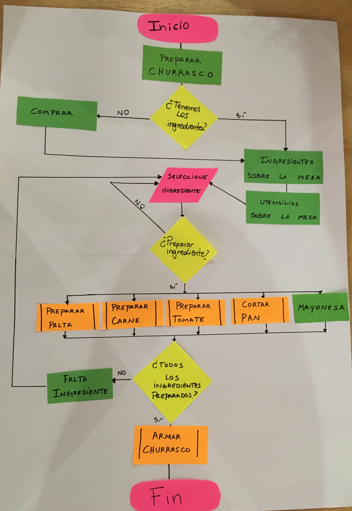

# Proyecto preparación de sandwich

####Este proyecto tiene un diagrama de flujo sobre como preparar un sandwich

#### Este *Proyecto* muestra:

* inicio
* como preparar un churrasco
* si tenemos los ingredientes o los debemos comprar
* una vez que tenemos los ingredientes ponerlos sobre la mesa
* sacamos los utensilios sobre la mesa (tenedor-cuchillo-cuchara-platos)
* seleccionamos los ingredientes
* preparamos el ingrediente (seleccionamos cual ingrediente queremos preparar)
* si este ya esta preparado volvemos a seleccionar el ingrediente que ya este seleccionado
* una vez que creemos que estan todos listos corroboramos, ¿Todos los ingredientes preparados? (en caso de que no esten todos incluidos volvemos a seleccionar un ingrediente)
* una ves que esten todos listos y preparados armamos nuestro churrasco
